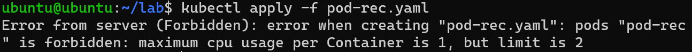
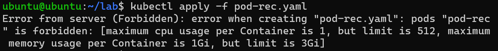
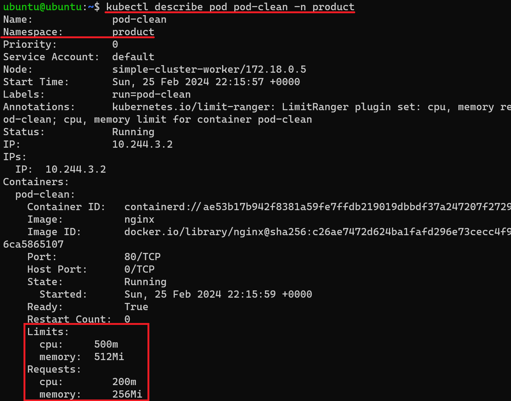
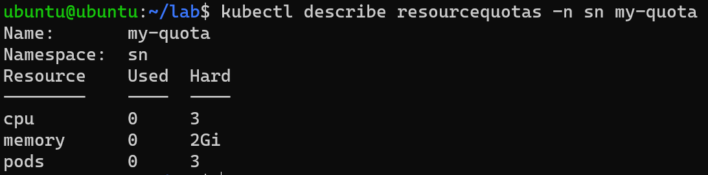
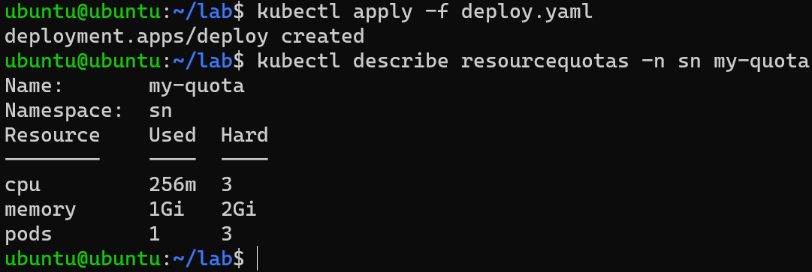
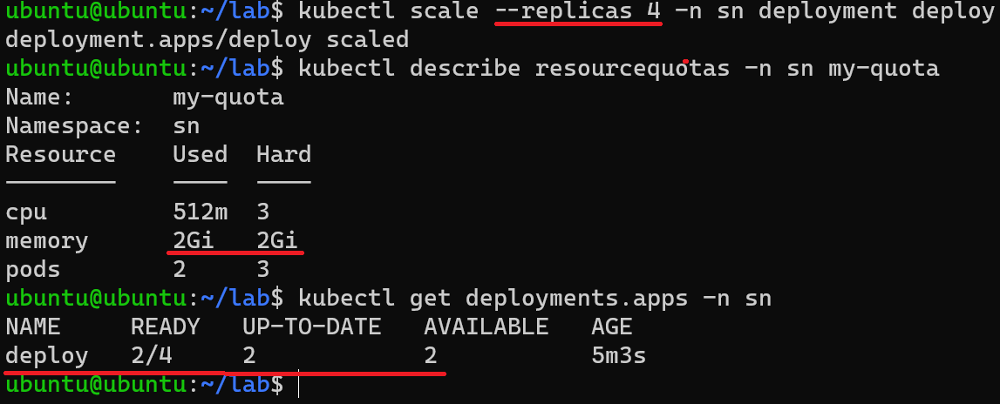
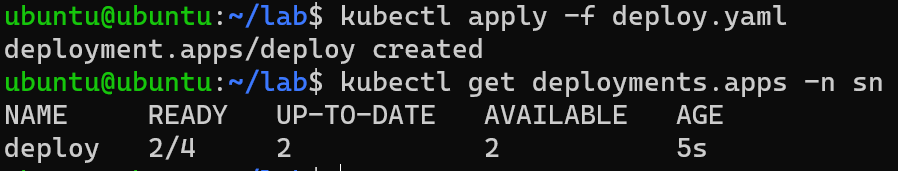
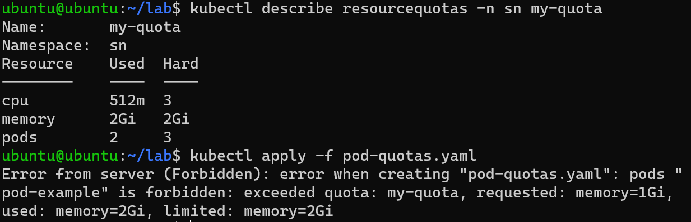
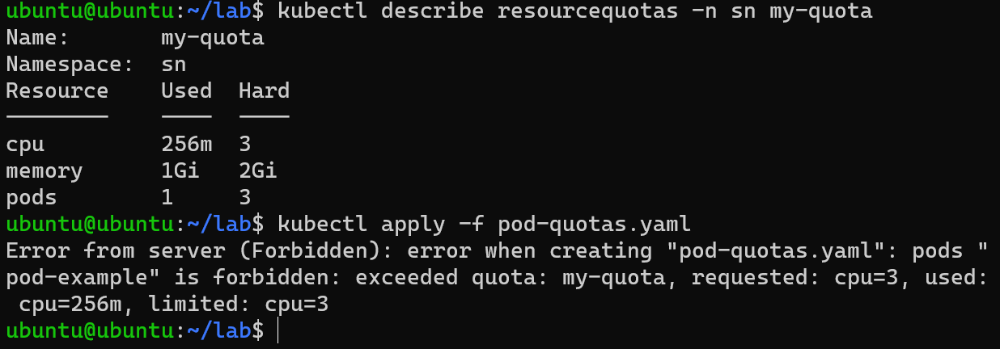

# Gerenciando os recursos do Kubernetes

Quando várias aplicações compartilham o mesmo cluster é necessário distribuir os recursos de forma adequada e garantir recursos que foram reservados para cada aplicação não sejam utilizados por outra. A distribuição e controle de recursos pode ser realizada utilizando políticas que podem ser definidas no Kubernetes. Essas políticas podem ser definidas utilizando o `LimitRange` e a `ResourceQuota`.

O presente documento descreve como gerenciar os recursos do Kubernetes definindo políticas com o `LimitRange` e `ResourceQuota` de forma resumida e com exemplos da sua aplicação. Com o objetivo de apresentar um estudo introdutório sobre o tema, primeiro é apresentado o `LimitRange` e em seguinda mostra como a `ResourceQuota` trás mecanismos que complementa o controle dos recursos.

## 1 Limit Range

Um `LimitRange` é uma política que restringe a alocação de recursos para os containers dos Pods em um namespace. Essa política define límites mínimos e máximos que garantem que os containers esjetam dentro de intervalos aceitáveis de recursos. Além disso, permite a definição de valores padrão para containers em que a quantidade de recursos não foi definida.

Vamos iniciar com um exemplo: precisamos definir limites a utilização de recursos no namespace **product**, para fazer isso podemos utilizar o `LimitRange` abaixo:

```yaml
apiVersion: v1
kind: LimitRange
metadata:
  name: resource-limits
  namespace: product
spec:
  limits:
  - default: #Limite máximo
      cpu: 500m
      memory: 512Mi
    defaultRequest: #Requisição padrão caso não for definida...
      cpu: 200m
      memory: 256Mi
    min:
      cpu: 100m
      memory: 128Mi
    max:
      cpu: 1
      memory: 1Gi
    type: Container
```

O `LimitRange` acima vai funcionar da seguinte forma nos containers do namespace product:
- Para containers que **não** tiveram os valores de `requests` e `limits` definidos na seção `resource`: 
  - `default`: define o limite padrão máximo, ou seja, define os valores de `limits` dos containers.
  - `defaultRequest`: define os valores de `requests` dos containers.
- Para containers que tiveram os valores de `requests` e `limits` definidos:
  - Será verificado se os valores definidos de `requests` e `limits` do container estão dentro do intervalo definido por `min` limite mínimo e o `max` é o limite máximo.
  - Se os valores de de `requests` e `limits` estiverem fora do intervalo ele não será provisionado e uma mensagem de erro será exibida.

Para testar podemos tentar criar um `Pod` como definido abaixo: 

```yaml
apiVersion: v1
kind: Pod
metadata:
  creationTimestamp: null
  labels:
    run: pod-example
  name: pod-example
  namespace: product
spec:
  containers:
  - image: nginx
    name: pod-example
    ports:
    - containerPort: 80
    resources:
      requests:
        cpu: "256m"
        memory: "1Gi"
        ephemeral-storage: "1Gi"
      limits:
        cpu: "512"
        memory: "1Gi"
        ephemeral-storage: "2Gi"
  dnsPolicy: ClusterFirst
  restartPolicy: Always
status: {}
```

Para testar se o `Limit Range` está realmente funcionando da forma esperada, altere os valores de `requests` e `limits` para desrespeitar a restrição definida e verificar se os `Pods` com containers que possuem valores de `requests` ou `limits` fora do range são provisionados.

Alterando o valor de **cpu** dentro de `limits` para um valor superior (aumentando para 2) que o permitido `Limit Range` temos o seguinte resultado:



O limite para `cpu` é 1 e definimos no nosso container que precisamos de 2, logo o provisionamento não é permitido. Podemos fazer algo semelhante para memória, definido o triplo do valor permitido temos:



Obs.: O `LimitRange` verifica apenas os valores dos `limits` pois, os valores de `limits` devem sempre ser maiores que o de `requests`. 

Podemos também, criar um pod sem a definição dos valores de `requests` e `limits` e verificar se os valores definifos no `LimitRange` foram atribuídos:

Crie o pod com o comando abaixo:

```shell
kubectl run pod-clean --image=nginx --port=80 -n product
```

Agora veja os valores relacionados aos recursos do `Pod` criado:



Observando as partes marcadas na figura, é possível notar que os valores padrão definidos no `LimitRange` foram atribuídos.

Por fim, podemos afirmar que definir políticas com o `LimitRange` é uma forma útil para controlar a utilização dos recursos no cluster, possibilitando assim uma maior cvapacidade de supervisão dos administradores. Essas políticas podem ser complementadas com as `ResourceQuotas`, que contribuem no controle de recursos agregados dentro de um determinando **namespace**.

## 2 ResourceQuotas

O `ResourceQuota` possibilita a definição de restrições que limitam o consumo de recursos agregados por **namespace**. Essas restrições podem limitar a quantidade de objetos que podem ser criados e a quantidade total de recursos computacionais que podem ser consumidos por recursos.

As `ResourceQuotas` funcionam da seguinte maneira:
- O administrador do cluster cria um objeto `ResourceQuota` para cada namespace;
- Os usuários criam os recursos (pods, services e etc) no namespace e o sistema de cotas monitora o uso para que ele não exceda os limite definidos na `ResourceQuota`;
- Se a criação ou atualização de algum recurso violar uma restrição de cota, o solicitação falhará com o código de status `HTTP 403 FORBIDDEN` acompanhando de uma mensagem de erro explicando a restrição violada;
- Se uma cota estiver ativada no namespace, todo o container deve especificar os recursos que vão ser utilizados no `requests` e `limits`, caso contrário o sistema de cotas poderá rejeitar a criação do container. Para evitar esse problema, podemos definir valores padrão utilizando um `LimitRange`.

Um exemplo de política definida por uma `ResourceQuota` é:
- Em um cluster com capacidade de 16 núcleos de vCPU e 32 GiB de memória RAM vamos permitir a equipe A usar 12 núcleos de vCPU e 24 GiB de memória RAM. Vamos também permitir que a equipe B possa utilizar até 4 núcles de vCPU e 8 GiB de memória RAM.

Vamos agora analisar um exemplo de definição de cota em um namespace. Para fazer isso, observe a definição de `ResourceQuota` abaixo:

```yaml
apiVersion: v1
kind: ResourceQuota
metadata:
  name: my-quota
  namespace: sn
spec:
  hard:
    cpu: "3"
    memory: 2Gi
    pods: "3"
```

Na Cota acima, definimos um limite máximo de 3 vCPUs, 2GiB de memória e 3 Pods para o namespace `sn`. As informações com relação a utilização dessa conta podem ser consultadas como na figura abaixo:



Para começar a testar a Cota (política) definida, vamos utilizar a definição do`Pod` utilizada para exemplificar o `LimitRange` e o Deployment abaixo:

```yaml
apiVersion: apps/v1
kind: Deployment
metadata:
  creationTimestamp: null
  labels:
    app: deploy
  name: deploy
spec:
  replicas: 1
  selector:
    matchLabels:
      app: deploy
  strategy: {}
  template:
    metadata:
      creationTimestamp: null
      labels:
        app: deploy
    spec:
      containers:
      - image: nginx
        name: nginx
        ports:
        - containerPort: 80
        resources:
          requests:
            cpu: "256m"
            memory: "1Gi"
          limits:
            cpu: "512"
            memory: "1Gi"
```

Na figura abaixo é apresentada a criação do Deployment com apenas 1 réplica e após isso, a verificação da utilização das cotas:



Agora vamos utilizar mais recursos, escalando o Deployment para 4 réplicas:



Observando a saída do terminal verificamos que o número de réplicas cresceu apenas para 2 devido ao limite de memória definido na cota. Esse comportamento também ocorre se tentarmos criar o mesmo Deployment com 4 réplicas:



Um outro exemplo é criar um `Pod` quando toda a cota para um determinado recurso já foi utilizada, observe no exemplo abaixo para o caso de passar do limite de memória:



Observe a mensagem de erro, o `Pod` não pode ser criado porque vai ultrapassar os limites de memória definidos. 

Para finalizar, vamos para mais um exemplo, ainda temos 2,5 vCPUs disponíveis na cota, observe abaixo a tentativa de criação de um `Pod` que requisita 3 vCPUs:



Observe novamente a mensagem de erro, o `Pod` não pode ser criado porque vai ultrapassar os limites de CPU definidos. 

Esses exemplos são uma curta demosntração do poder das `ResourceQuotas`. Com elas podemos definir não apenas restrições para recursos computacionais como uso de CPU e Memória, mas também cotas para **cotas de contagem de objetos** e **recursos de armazenamento**.

A contagem de objetos vai além dos `Pods`, podemos limitar o número de services, secrets, configmaps, deployments, jobs, cronjobs e etc. No caso de cotas para armazenamento podemos definir um limite para solicitações de volumes persistentes, total de [Persistent Volume Claims](https://kubernetes.io/docs/concepts/storage/persistent-volumes/#persistentvolumeclaims), número total de declarações de volumes persistentes que podem existit no namespace e etc.

Desse modo, as `ResourceQuotas` possibilitam para os administradores do cluster um maior controle do cluster e uma distribuição melhor dos recursos do entre as equipes de desenvolvimento. Para saber mais sobre as contas consulte a [documentação oficial](https://kubernetes.io/pt-br/docs/concepts/policy/resource-quotas/) do Kubernetes.

## Conclusão

O presente documento demostrou como definir políticas para gerenciar recursos de um cluster com o `LimitRange` e `ResourceQuota`. O `LimitRange` possibilita definir limites padrão, inferiores e superiores para a utilização de recursos por containers. Por sua vez, o `ResourceQuota` possibilita um controle dos recursos agregados em um namespace. Esses objetos são complementares e possibilitam uma maior capacidade de gerenciamento dos recursos do cluster pelos administradores.

## Referências

[Documentação do Kubernetes: Limit Ranges](https://kubernetes.io/docs/concepts/policy/limit-range/)

[OpenShift Container Platform -  Chapter 25: Setting Limit Ranges](https://access.redhat.com/documentation/pt-br/openshift_container_platform/3.11/html/cluster_administration/admin-guide-limits)

[How to use Kubectl Scale](https://www.airplane.dev/blog/kubectl-scale)

[Documentação do Kubernetes: ResourceQuotas](https://kubernetes.io/pt-br/docs/concepts/policy/resource-quotas/)

[A Comprehensive Guide to Resource Quotas in Kubernetes: Key Concepts and Usage Examples](https://medium.com/@prateek.malhotra004/a-comprehensive-guide-to-resource-quotas-in-kubernetes-key-concepts-and-usage-examples-8ac4222027e2)